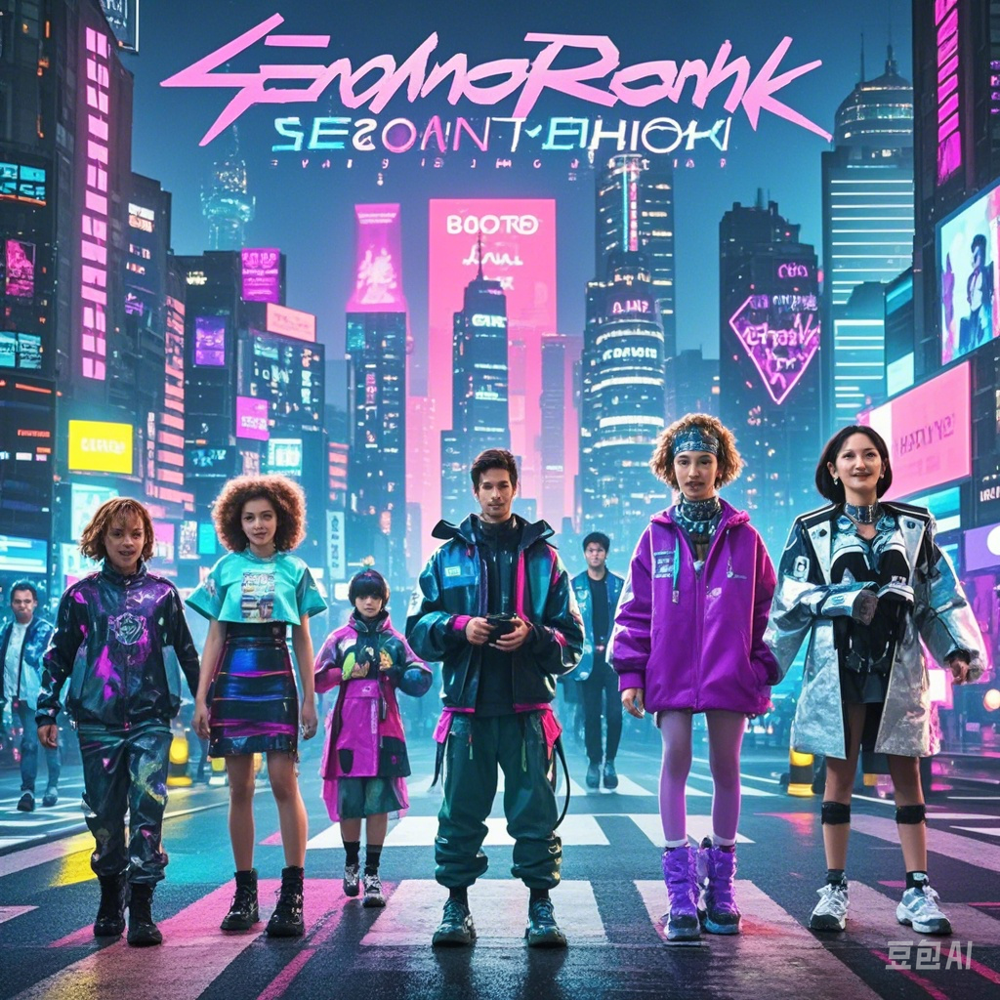

# Elevator Pitch  
prompts:  
你是一个高级的产品设计师 ,你可以很好的推荐你的产品 ,为“情感影院”撰写一个引人入胜的电梯推介 描述该平台的核心功能：通过分析20至35岁年轻用户的个性特征和兴趣爱好 ,利用编辑距离算法智能推荐电影 同时 ,强调社交互动功能 ,让用户能够通过距离匹配找到附近志同道合的人 ,进行邀请聊天 确保提及平台的个性化体验、社交互动的重要性 ,以及简便的用户体验 ,传达出平台的独特价值   
result:  
欢迎来到情感影院 ,一款专为20至35岁年轻观众打造的创新电影推荐平台 我们深知 ,电影不仅是娱乐 ,更是情感共鸣的体验 通过分析用户的个性特征和兴趣爱好 ,情感影院利用先进的编辑距离算法 ,为您精准推荐最符合您情感需求的电影  但这还不是全部！情感影院的社交互动功能 ,让您不仅能找到理想的电影 ,还能找到志同道合的朋友 通过地理位置匹配 ,您可以轻松发现附近的影迷 ,发起邀请聊天 ,共同分享对电影的热爱与看法 想象一下 ,您与新朋友一起观看一部心仪的电影 ,然后在观影后的讨论中 ,深入交流 ,增进友谊 ,这将是一种多么美好的体验！ 我们致力于提供简便易用的界面 ,让每位用户都能轻松导航 ,快速找到最适合自己的观影选择 无论您是电影爱好者还是寻找社交机会的年轻人 ,情感影院都将是您理想的选择 加入情感影院 ,让我们一起开启一段充满情感与乐趣的电影之旅 ,拓展您的观影视野 ,同时结识更多志同道合的朋友！  

# User Persona
prompts:  
你是一个高级的产品设计师  
请生成一个详细的用户画像 ,专为“情感影院”平台的目标用户群体设计 该群体主要包括20至35岁的人士 ,涵盖各种背景 用户在注册时需要填写个性特征和兴趣爱好 ,以便获取个性化的电影推荐   
请考虑以下要素：
背景特征：描述用户的教育水平、职业类型和收入范围   
兴趣与爱好：列出用户可能的兴趣和爱好 ,特别是除了观看电影之外的活动   
观影习惯：说明用户的观影习惯 ,特别是他们是否倾向于在电影院观看电影   
技术使用：评估用户在技术使用方面的熟练程度 ,特别是他们使用手机应用的习惯   
挑战与需求：识别用户在寻找电影和社交互动时可能面临的挑战 ,以及他们希望通过“情感影院”平台解决的具体需求   
请确保用户画像真实且具体 ,以便为“情感影院”平台的开发和改进提供指导   

# User Journey
prompts:  你是一个资深产品经理 ,我现在需要做一个User Journey ,创建“情感影院r”用户旅程时 ,请描述用户从发现应用到观影的全过程 ,包括以下步骤：  
发现应用（社交媒体、朋友推荐等）  
注册并创建个人资料（填写兴趣、电影偏好）  
浏览匹配用户（查看用户资料、兴趣）  
发起聊天（与志同道合用户互动）  
安排观影（选择电影、时间、地点）  
观影体验（分享感受、评分电影）  
反馈与改进（用户对应用的评价和建议）  
关注用户的情感变化和需求  
以表格的形式返回结果给我 ,该表格包含了用户行动（User Action）、触点（Touch Points）、情绪（Emotions）、痛点（Pain Points）以及可能的解决方案（Possibility Solution）五个方面 

result:

说明:  
用户行动：详细描述用户在每个阶段的具体行为   
触点：用户与应用或其他用户互动的具体渠道或环节    
情绪：用户在每个阶段可能感受到的情绪状态   
痛点：用户在旅程中可能遇到的主要问题或挑战   
可能的解决方案：针对每个痛点 ,提出的可行解决方案 ,以提升用户体验   

# Movie Poster

prompts:
生成一张赛博朋克风格的电影海报 ,标题为“情感共鸣” 场景设定在一个充满霓虹灯光的未来城市 ,摩天大楼高耸入云 ,街道上布满了闪烁的全息广告 海报前景中 ,有一组多样化的角色 ,代表不同的情感（快乐、悲伤、愤怒等） ,身穿时尚的高科技服装 ,正在与先进技术互动 色彩方案结合深蓝色、亮粉色和紫色 ,营造出一种氛围感和沉浸感 标题“情感共鸣”以现代、大胆的字体 prominently 显示在顶部   

result:
